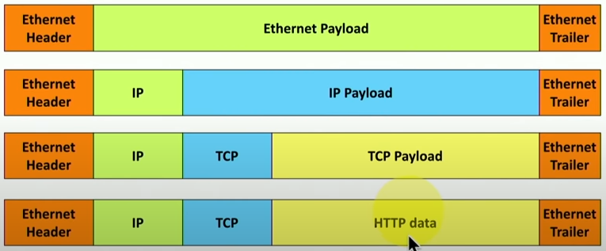

------------------------------------
# Comptia A+ Exam Notes
------------------------------------
## Topics Covered:

* IP (Internet Protocol)

------------------------------------
### Section 1 : IP
------------------------------------

#### Internet Protocol

 - Allows you to efficiently move large amounts of data across a network.
 - Internet Protocol sends information using an __Ethernet Frame__:
 